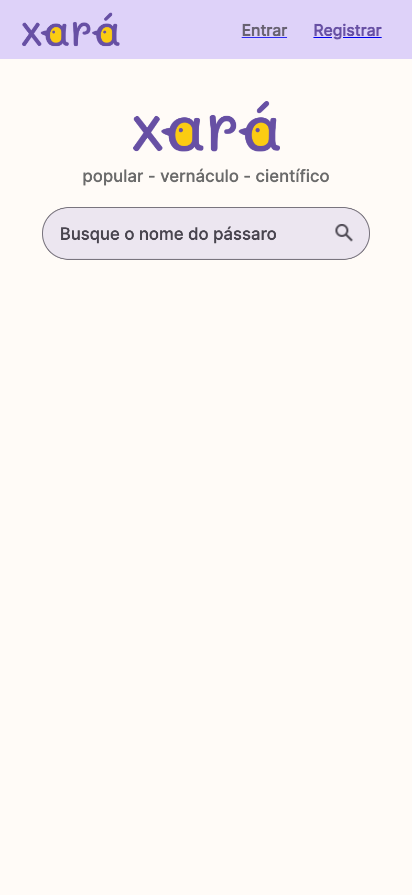
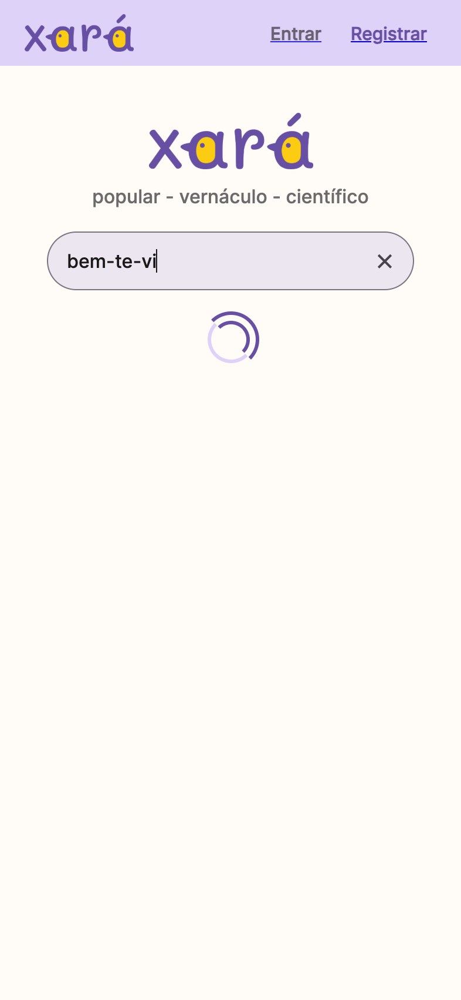
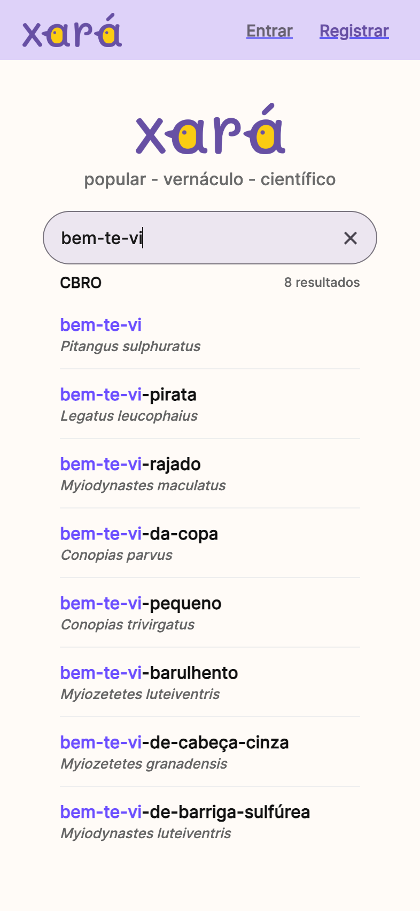
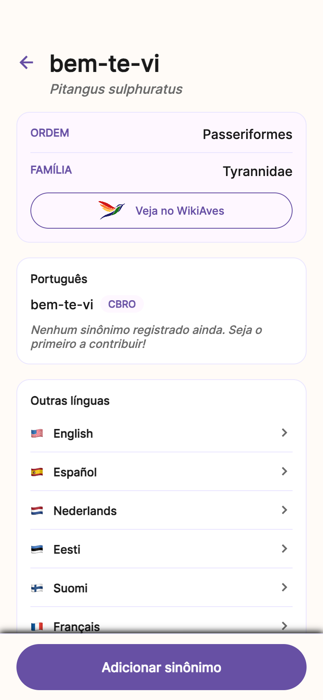

# Play Store Assets - Xará

## 📦 Conteúdo

Este diretório contém todos os assets necessários para publicar o app no Google Play Console.

### Arquivos Inclusos

#### ✅ Ícone
- **`icon-512x512.png`** (512 x 512 px)
  - Formato: PNG
  - Uso: Ícone principal do app
  - Logo ampliado para máxima visibilidade

#### ✅ Feature Graphic
- **`feature-graphic.png`** (1024 x 500 px)
  - Formato: PNG
  - Uso: Banner principal da ficha do app
  - Design com gradiente roxo e logo + texto

#### ✅ Screenshots (Mobile)
- **`1-home.png`** - Tela inicial com logo e busca
- **`2-search.png`** - Campo de busca com texto digitado
- **`3-results.png`** - Resultados da busca (8 variações de bem-te-vi)
- **`4-species.png`** - Página de detalhes de uma espécie

**Especificações:**
- Dimensões: 393 x 851 px (Pixel 5)
- Escala: 2x (786 x 1702 efetivo)
- Formato: PNG
- ✅ Atendem requisitos do Google Play (mínimo 320px)

#### ✅ Screenshots (Tablet 7")
- **`tablet-7-1-home.png`** - Tela inicial
- **`tablet-7-2-search.png`** - Campo de busca
- **`tablet-7-3-results.png`** - Resultados da busca
- **`tablet-7-4-species.png`** - Página de detalhes

**Especificações:**
- Dimensões: 1200 x 1920 px
- Escala: 1.5x
- Formato: PNG

#### ✅ Screenshots (Tablet 10")
- **`tablet-10-1-home.png`** - Tela inicial
- **`tablet-10-2-search.png`** - Campo de busca
- **`tablet-10-3-results.png`** - Resultados da busca
- **`tablet-10-4-species.png`** - Página de detalhes

**Especificações:**
- Dimensões: 1600 x 2560 px
- Escala: 1.5x
- Formato: PNG

---

## 🎯 Como Usar no Google Play Console

### 1. Ícone do App

**Localização:** Configuração do app → Detalhes do app → Ícone do app

**Arquivo:** `icon-512x512.png`

**Requisitos:**
- 512 x 512 px ✅
- PNG de 32 bits ✅
- Até 1 MB ✅

### 2. Feature Graphic

**Localização:** Configuração do app → Recursos gráficos da ficha → Imagem de recursos gráficos

**Arquivo:** `feature-graphic.png`

**Requisitos:**
- 1024 x 500 px ✅
- JPEG ou PNG ✅
- Até 15 MB ✅

### 3. Screenshots

**Localização:** Configuração do app → Recursos gráficos da ficha

#### Screenshots de smartphone

**Arquivos:** Todos os 4 screenshots (ou escolha 2-8 deles)

**Requisitos:**
- Mínimo 2, máximo 8 screenshots ✅
- JPEG ou PNG de 24 bits ✅
- Mínimo 320px na menor dimensão ✅
- Máximo 3840px na maior dimensão ✅
- Proporção entre 16:9 e 9:16 ✅

**Ordem sugerida:**
1. `1-home.png` - Primeira impressão (tela inicial)
2. `3-results.png` - Funcionalidade principal (busca)
3. `4-species.png` - Detalhes e informações
4. `2-search.png` - Interação (digitando)

#### Screenshots de tablet 7"

**Arquivos:** `tablet-7-*.png` (4 screenshots)

**Uso:** Opcional, mas recomendado para melhor visualização em tablets

#### Screenshots de tablet 10"

**Arquivos:** `tablet-10-*.png` (4 screenshots)

**Uso:** Opcional, mas recomendado para melhor visualização em tablets grandes

---

## 📝 Textos para o Play Store

### Descrição Curta (80 caracteres)
```
Plataforma colaborativa de nomes populares de aves brasileiras
```

### Descrição Completa

```
O Xará é uma plataforma colaborativa que permite registrar e consultar nomes populares e sinônimos de aves brasileiras.

🔍 BUSCA INTELIGENTE
• Busque espécies por nome popular, vernáculo ou científico
• Descubra variações regionais dos nomes
• Explore a rica diversidade de nomenclaturas

✍️ CONTRIBUA
• Registre nomes populares que você conhece
• Adicione sinônimos regionais
• Ajude a preservar o conhecimento tradicional

🌿 COLABORATIVO
• Plataforma mantida pela comunidade
• Contribuições validadas
• Conhecimento compartilhado

📚 EDUCATIVO
• Aprenda sobre as aves do Brasil
• Descubra curiosidades sobre nomes regionais
• Conecte-se com outros observadores de aves

Contribua com os nomes populares que você conhece e ajude a preservar o conhecimento sobre as aves do Brasil!
```

### Categoria
- **Principal:** Educação
- **Subcategoria:** Referência

---

## 🔧 Gerar Novos Screenshots

Se precisar atualizar os screenshots:

```bash
# Instalar dependência (se ainda não tiver)
npm install --save-dev puppeteer

# Executar script de mobile
node scripts/take-screenshots.js

# Executar script de tablets
node scripts/take-tablet-screenshots.js
```

Os novos screenshots serão salvos neste diretório.

**Nota:** O feature graphic e o ícone são gerados via scripts Python usando PIL (Pillow).

---

## ✅ Checklist de Upload

Antes de fazer upload no Google Play Console:

- [x] Ícone 512x512 preparado (logo ampliado)
- [x] Feature Graphic 1024x500 preparado
- [x] Mínimo 2 screenshots mobile prontos (temos 4)
- [x] Screenshots tablet 7" preparados (4 screenshots)
- [x] Screenshots tablet 10" preparados (4 screenshots)
- [x] Screenshots em formato adequado (PNG)
- [x] Dimensões dentro dos limites
- [x] Descrição curta pronta
- [x] Descrição completa pronta
- [x] Categoria selecionada

---

## 📱 Preview dos Screenshots

### 1. Home

Tela inicial com logo Xará e campo de busca

### 2. Search

Usuário digitando "bem-te-vi" na busca

### 3. Results

8 resultados mostrando variações de bem-te-vi com nomes científicos

### 4. Species

Página de detalhes com ordem, família, nomes em português e outras línguas

---

## 📞 Suporte

Se precisar de ajuda ou quiser gerar screenshots personalizados, entre em contato.
